# Quaternion

A study repository with **three independent Python implementations of quaternion
algebra**, each taking a different approach and offering its own visualization
of rotations in 3D space.

| Folder | Core idea | Visualization |
| --- | --- | --- |
| [`quaternion_wynn/`](quaternion_wynn/) | Full-featured port of [`pyquaternion`](https://github.com/KieranWynn/pyquaternion) by Kieran Wynn | `matplotlib` animation of a rotating triad |
| [`quaternion_matplot/`](quaternion_matplot/) | Subclass of the Wynn `Quaternion` that adds a "flag"-style 3D plot | Static `matplotlib` 3D plot (arrow + flag) |
| [`quaternion_simplega/`](quaternion_simplega/) | Minimal from-scratch implementation (port of `SimpleGA.jl/quaternions.jl`) with rich didactic plotting | 7-figure didactic gallery: conjugate, rotation, SLERP, composition, flags, sandwich product |

All three packages are self-contained Python modules; pick one depending on
whether you want a production-style API (`quaternion_wynn`), a simple plotting
helper (`quaternion_matplot`), or detailed teaching figures
(`quaternion_simplega`).

---

## `quaternion_wynn/` — pyquaternion port

A near-verbatim copy of Kieran Wynn's `pyquaternion` module. Supports
construction from axis/angle, rotation matrices, arrays, SLERP, exp/log,
random unit quaternions, and rotation of 3-vectors.

### Usage

```python
from quaternion_wynn.quaternion import Quaternion

# +90° about the +y axis
q = Quaternion(axis=[0, 1, 0], degrees=90)

v = [0, 0, 4]
print(q.rotate(v))                     # → [4, 0, 0]

# SLERP between two orientations
q0 = Quaternion(axis=[0, 1, 0], angle=0)
for qi in Quaternion.intermediates(q0, q, 9, include_endpoints=True):
    print(round(qi.degrees, 2), qi.axis)
```

Run the interactive animation (rotating coordinate triad):

```powershell
python quaternion_wynn/quaternion_animation.py
```

A still snapshot of several SLERP samples applied to the basis triad:

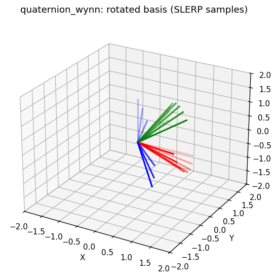

The folder also contains `algebra.py` / `r020.py`, an alternative
Clifford-algebra `Cl(0,2,0)` view of the same algebra.

---

## `quaternion_matplot/` — Wynn quaternion + flag plot

Reuses the same `Quaternion` class as `quaternion_wynn`, and adds a
`QuaternionPlot` subclass that draws each quaternion as an oriented **flag** in
3D: a pole along the rotation axis with a small pennant whose orientation
encodes the rotation angle.

### Usage

```python
from quaternion_matplot.quaternion_plot import QuaternionPlot
import matplotlib.pyplot as plt

q1 = QuaternionPlot(axis=[1, 0, 0], degrees=90)
q2 = QuaternionPlot(axis=[0, 1, 0], degrees=90)
q3 = q2 * q1            # composition

ax = q1.plot(clr="r")
ax = q2.plot(ax, clr="g")
ax = q3.plot(ax, clr="b")
plt.show()
```

Run the bundled examples:

```powershell
python quaternion_matplot/quaternion_plot.py    # built-in test cases
python quaternion_matplot/demo1.py              # text demo (rotation + SLERP)
python quaternion_matplot/demo2.py              # matplotlib animation
```

### Figures

| Single quaternion | Several axes/angles |
| --- | --- |
| 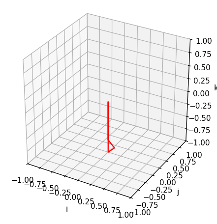 | 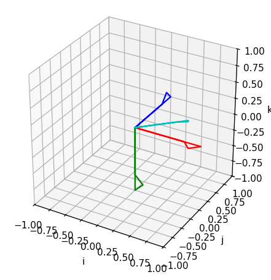 |

| Non-unit axes (norm effect) | Multiplication: `q1`, `q2`, `q2·q1`, `q2⁻¹`, `q2·q1·q2⁻¹` |
| --- | --- |
| 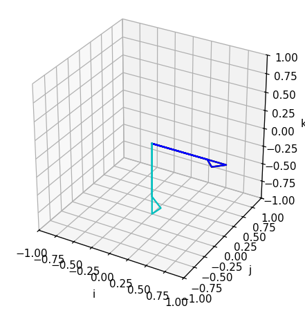 | 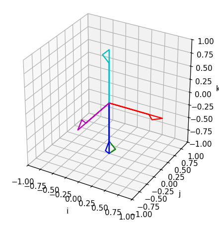 |

---

## `quaternion_simplega/` — minimal quaternion + didactic gallery

A small, dependency-light `Quaternion` class (`__slots__`-based) ported from
`SimpleGA.jl/src/quaternions.jl`, paired with the most extensive visualization
in this repo (`quaternion_visualization.py`).

The visualizer provides:

- `axis_angle(q)`, `rotate_vec(q, v)`, `slerp(q1, q2, t)` geometry helpers
- a chainable `QuaternionVisualizer` class
  (`add_quaternion`, `add_flag`, `add_slerp`, `add_composition`,
  `add_sandwich_rotation`, `add_unit_sphere`, …)
- convenience factories: `visualize_quaternion`, `visualize_flag`,
  `visualize_slerp`, `visualize_sandwich_rotation`,
  `visualize_unnormalized_flag`.

### Usage

```python
import math
from quaternion_simplega.quaternions import Quaternion
from quaternion_simplega.quaternion_visualization import QuaternionVisualizer

# Build a unit quaternion (90° about z)
s = math.sin(math.pi / 4)
q = Quaternion(math.cos(math.pi / 4), 0.0, 0.0, s)

(QuaternionVisualizer(title="q (90° z) and q†")
    .draw_axes()
    .add_unit_sphere()
    .set_limits(1.5)
    .add_flag(q,        color="steelblue", label="q")
    .add_flag(q.conj(), color="tomato",    label="q†")
    .legend()
    .show())
```

Run the full 7-figure gallery:

```powershell
python quaternion_simplega/quaternion_visualization.py
```

### Figures

| `q` and conjugate `q†` | Rotation of basis vectors |
| --- | --- |
| 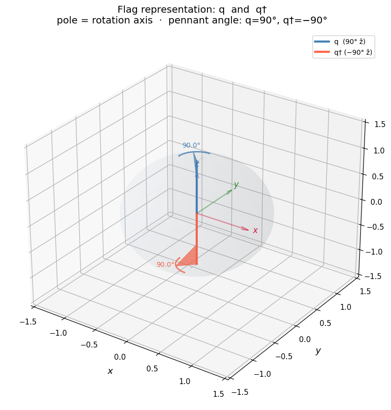 | 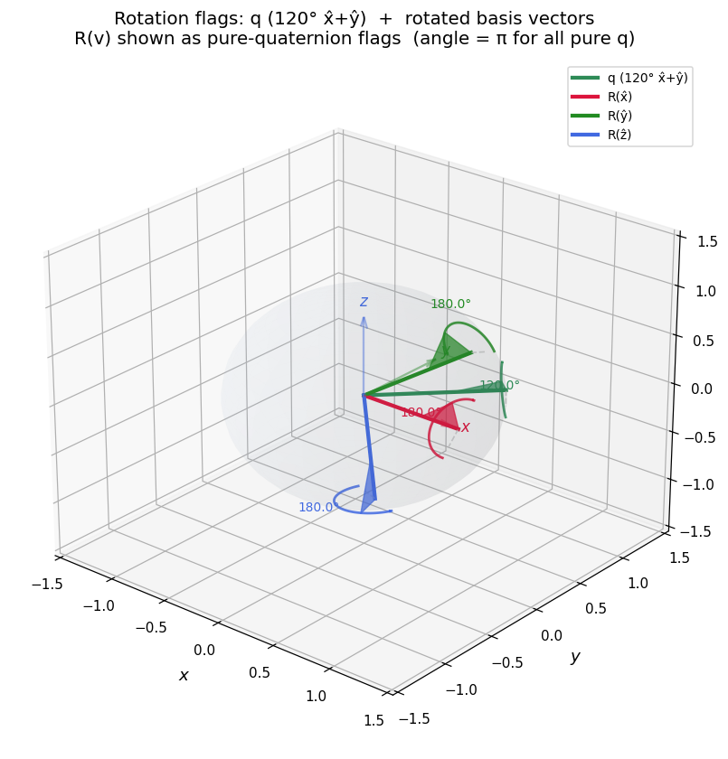 |

| SLERP path as a sequence of flags | Composition `q₁`, `q₂`, `q₁·q₂` |
| --- | --- |
| 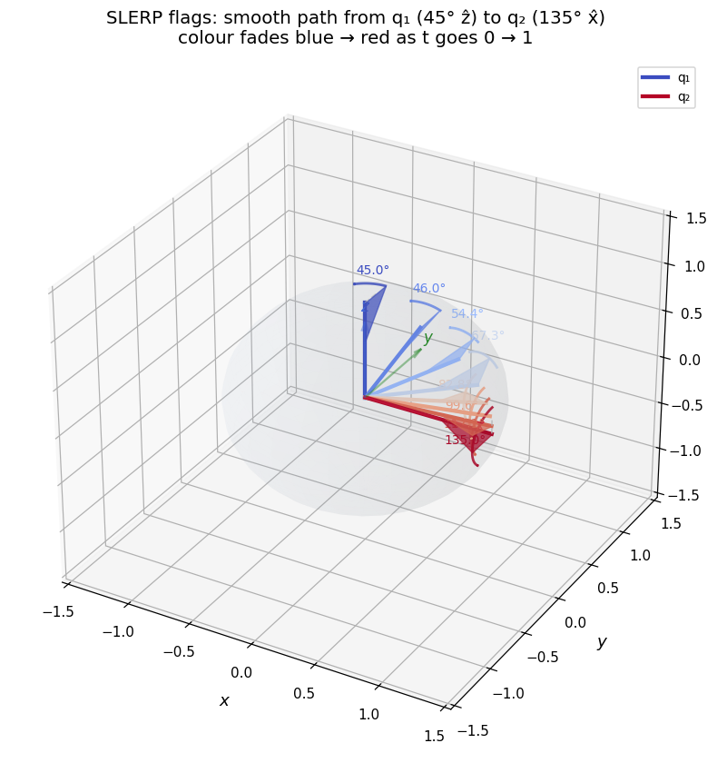 | 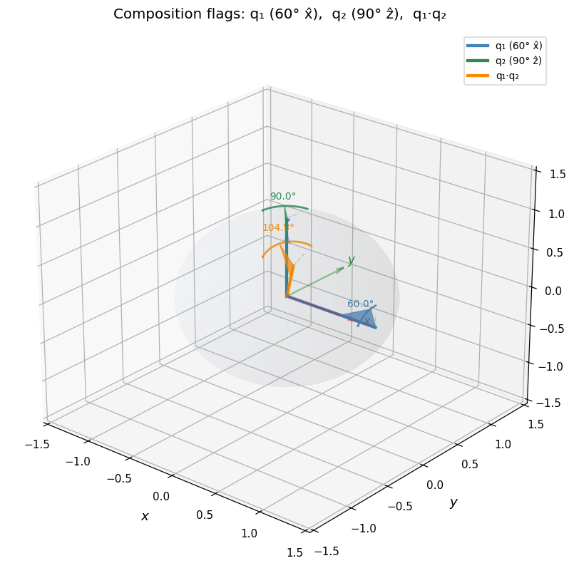 |

| Three unit quaternions as flags | Unnormalized flags (pole length = ‖q‖) |
| --- | --- |
| 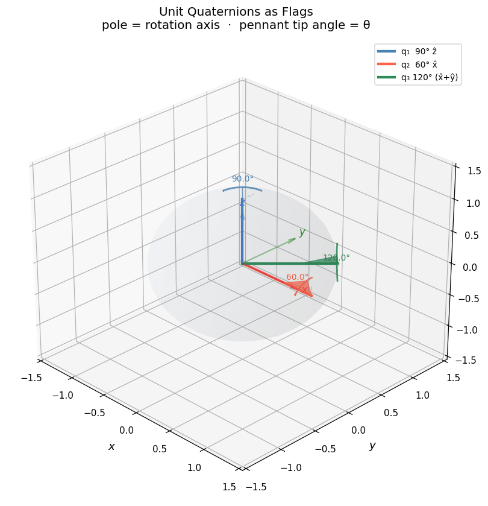 | 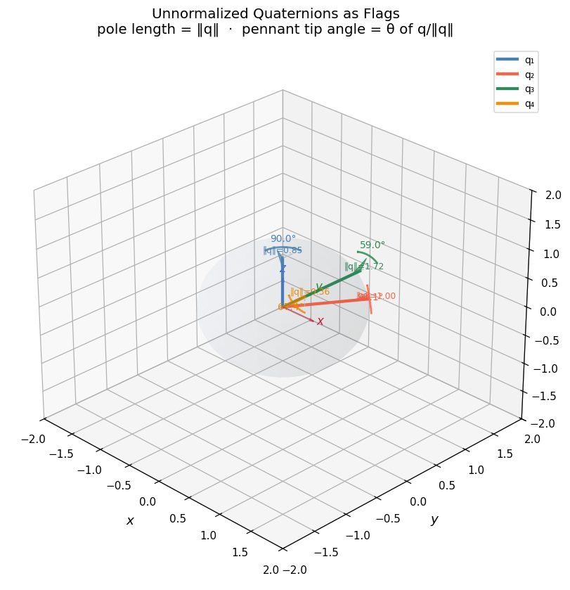 |

Sandwich product `r = q · p · q†` with non-unit quaternions:

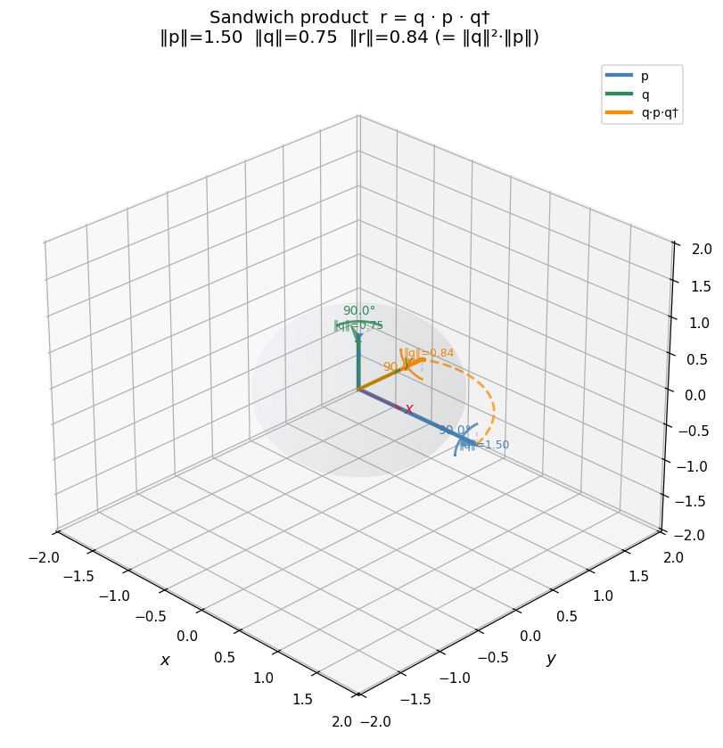

---

## Installation (Windows / PowerShell)

```powershell
# create a virtual environment
python -m venv C:\Users\<you>\Documents\Envs\quat
C:\Users\<you>\Documents\Envs\quat\Scripts\Activate.ps1

# the three packages only need numpy + matplotlib
pip install numpy matplotlib
```

Then run any of the scripts above from the repository root.

### Regenerating the figures in `doc/`

The PNGs in [`doc/`](doc/) are produced by the small helper scripts
`doc/_gen_simplega.py`, `doc/_gen_matplot.py`, and `doc/_gen_wynn.py`:

```powershell
$env:PYTHONIOENCODING="utf-8"
python doc\_gen_simplega.py
python doc\_gen_matplot.py
python doc\_gen_wynn.py
```

---

## Credits

- **pyquaternion** — Kieran Wynn,
  <https://github.com/KieranWynn/pyquaternion> (MIT). Used by
  `quaternion_wynn/` and `quaternion_matplot/`.
- **SimpleGA.jl** — basis for the minimal quaternion class in
  `quaternion_simplega/`.
- **bivector.net** — Clifford-algebra `Cl(0,2,0)` generator used by
  `quaternion_wynn/algebra.py`.